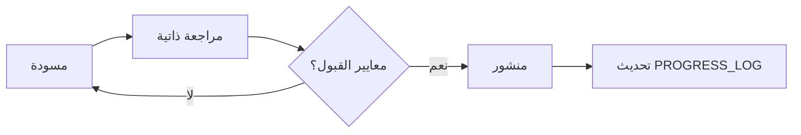

# حوكمة موسوعة معرض السيارات — Baraa Raed

## 1. الغرض والنطاق

هذه الموسوعة مرجع تعليمي وتطبيقي لإدارة معارض السيارات (جديدة ومستعملة) وربطها بنظام **Baraa Raed ERP**.  
الجمهور المستهدف: مالك المعرض، مدير الفرع، موظف المبيعات، المحاسب، موظف المخزون، وفريق التقنية.

**النطاق يشمل:**
- العمليات التجارية (شراء، عرض، بيع، حجز، أقساط)
- الإدارة المالية والمحاسبية
- إدارة العملاء والعملاء المحتملين
- الفروع والصلاحيات والتدقيق
- التشغيل دون اتصال والمزامنة
- الطباعة والتقارير والتكامل مع واتساب

**خارج النطاق:**
- منطق SaaS أو اشتراكات
- تسعير منتجات خارج المعرض
- محتوى قانوني ملزم — يُقدَّم كإرشاد عام ويُراجع محلياً

---

## 2. مبادئ المحتوى

| المبدأ | التطبيق |
|--------|---------|
| **تعليمي + تطبيقي** | كل فصل يشرح «لماذا» ثم «كيف» بخطوات قابلة للتنفيذ |
| **لا عناوين فارغة** | كل ملف فصل يحتوي محتوى كاملاً وفق القالب |
| **محاذاة النظام** | المصطلحات تطابق `lib/domain.ts` وجداول قاعدة البيانات |
| **لغة عربية فصيحة** | مصطلحات إنجليزية تقنية بين قوسين عند الحاجة |
| **أمثلة واقعية** | سيناريوهات عراقية/خليجية عامة (بغداد، دينار/دولار حسب السياق) |
| **قابلية الاختبار** | معايير القبول في نهاية كل فصل |

---

## 3. هيكل المستودع

```text
encyclopedia/
├── GOVERNANCE.md              ← هذا الملف
├── MASTER_PROMPT.md           ← البرومبت الرئيسي لتوليد الفصول
├── INDEX.md                   ← الفهرس التفصيلي
├── ACCEPTANCE_CRITERIA.md     ← معايير القبول العامة
├── PROGRESS_LOG.md            ← سجل التقدم ورمز الاستئناف
├── TEMPLATES/
│   └── CHAPTER_TEMPLATE.md
└── chapters/
    ├── 01-foundation/
    ├── 02-inventory/
    ├── 03-sales/
    └── ...
```

**تسمية الملفات:** `NN-MM-slug.md` حيث `NN` = رقم المجلد، `MM` = ترتيب الفصل داخل المجلد.

---

## 4. دورة حياة الفصل



1. **مسودة:** كتابة الفصل وفق `TEMPLATES/CHAPTER_TEMPLATE.md`
2. **مراجعة ذاتية:** التحقق من `ACCEPTANCE_CRITERIA.md` وقائمة الفصل
3. **منشور:** تحديث `INDEX.md` (حالة ✅) و`PROGRESS_LOG.md`
4. **تحديث:** تاريخ `last_updated` في ترويسة الفصل

---

## 5. الأدوار والمسؤوليات

| الدور | المسؤولية |
|-------|-----------|
| **محرر المحتوى** | كتابة الفصول، الأمثلة، السيناريوهات |
| **مراجع تقني** | مطابقة الجداول، الوحدات، وواجهات API |
| **مالك المنتج** | اعتماد الأولويات في الفهرس |
| **الوكيل الآلي** | توليد الفصول دفعات، تحديث السجل، إدراج رمز الاستئناف |

---

## 6. قواعد التحرير

- **الحد الأدنى للفصل:** 800 كلمة عربية أو ما يعادلها في الشرح العملي
- **الحد الأقصى الموصى به:** 3,500 كلمة (فصل طويل يُقسَّم)
- **الإصدارات:** `version: 1.0.0` في الترويسة؛ زيادة minor عند إضافة أقسام، major عند إعادة هيكلة
- **الروابط:** كل فصل يربط بالفصل السابق والتالي والوحدات ذات الصلة في النظام
- **عدم التكرار:** عند الاستئناف من رمز `RESUME-*` لا يُعاد نشر محتوى منشور

---

## 7. رموز الحالة في الفهرس

| الرمز | المعنى |
|-------|--------|
| ✅ | منشور ومطابق لمعايير القبول |
| 🔄 | قيد الكتابة |
| 📋 | مخطط — لم يُكتب بعد |
| ⚠️ | يحتاج مراجعة تقنية |

---

## 8. سياسة الاستئناف (Resume)

عند بلوغ حد الإخراج:

1. تحديث `PROGRESS_LOG.md` بآخر فصل مكتمل
2. إدراج كتلة `RESUME` بالصيغة:

```yaml
RESUME:
  code: RESUME-ENC-YYYYMMDD-NN
  next_chapter: "path/to/next/file.md"
  next_section: "اسم القسم داخل الفصل إن لم يكتمل"
  completed: ["قائمة الملفات المكتملة في هذه الجلسة"]
  do_not_repeat: ["ملفات لا تُعاد كتابتها"]
```

3. عدم لصق نص الفصول السابقة في رسالة الاستئناف

---

## 9. الربط مع مستودع النظام

| مكون الموسوعة | مرجع الكود |
|---------------|------------|
| وحدات النظام | `lib/domain.ts` → `modules` |
| الصلاحيات | `lib/domain.ts` → `permissionGroups` |
| الجداول | `docs/DATABASE_SCHEMA.sql` |
| البنية | `docs/ARCHITECTURE.md` |
| واجهة المستخدم | `components/dashboard-shell.tsx` |

---

## 10. المراجعة الدورية

- **شهرياً:** مراجعة الفصول ذات الصلة بالوحدات المُحدَّثة في الكود
- **عند إصدار رئيسي للنظام:** تحديث الفصول المتأثرة ورفع `version`
- **سجل التغييرات:** يُوثَّق في `PROGRESS_LOG.md` وليس في ملفات منفصلة إلا عند طلب صريح

---

*آخر تحديث للحوكمة: 2026-06-16 | الإصدار: 1.0.0*
