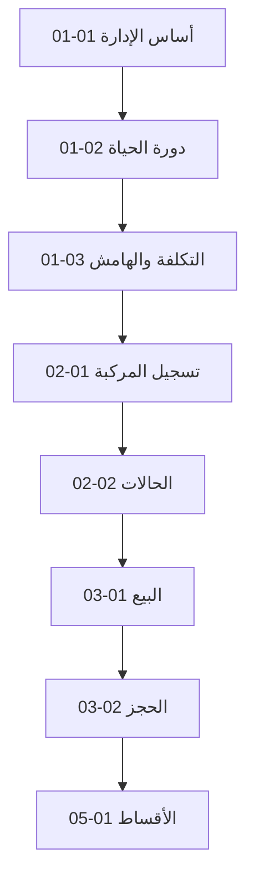

# الفهرس التفصيلي — موسوعة معرض السيارات

> **الإصدار:** 1.0.0 | **آخر تحديث:** 2026-06-16  
> **إجمالي الفصول المخططة:** 48 | **منشور:** 4 | **قيد الكتابة:** 0

---

## كيف تقرأ هذا الفهرس

- **المعرف:** `NN-MM` (مجلد-فصل)
- **الحالة:** ✅ منشور | 🔄 قيد الكتابة | 📋 مخطط | ⚠️ يحتاج مراجعة
- **الوحدة:** مفتاح من `lib/domain.ts`

---

## المجلد 01 — الأساس والمفاهيم (Foundation)

| المعرف | العنوان | الوحدة | الحالة | الملف |
|--------|---------|--------|--------|-------|
| 01-01 | ماذا يعني إدارة معرض سيارات احترافي؟ | `dashboard` | ✅ | [chapters/01-foundation/01-01-what-is-showroom-management.md](chapters/01-foundation/01-01-what-is-showroom-management.md) |
| 01-02 | دورة حياة السيارة في المعرض | `cars` | ✅ | [chapters/01-foundation/01-02-vehicle-lifecycle.md](chapters/01-foundation/01-02-vehicle-lifecycle.md) |
| 01-03 | هيكل التكلفة وهامش الربح | `cars`, `accounting` | ✅ | [chapters/01-foundation/01-03-cost-and-margin.md](chapters/01-foundation/01-03-cost-and-margin.md) |
| 01-04 | الفروع المتعددة ونموذج العمل | `branches` | 📋 | — |
| 01-05 | الأدوار والمسؤوليات اليومية | `employees`, `permissions` | 📋 | — |
| 01-06 | مؤشرات الأداء الرئيسية KPI للمعرض | `dashboard` | 📋 | — |

---

## المجلد 02 — المخزون والمركبات (Inventory)

| المعرف | العنوان | الوحدة | الحالة | الملف |
|--------|---------|--------|--------|-------|
| 02-01 | تسجيل مركبة جديدة (VIN والهوية الداخلية) | `cars` | ✅ | [chapters/02-inventory/02-01-vehicle-registration.md](chapters/02-inventory/02-01-vehicle-registration.md) |
| 02-02 | حالات المركبة ومتى تُغيَّر | `cars`, `inventory` | 📋 | — |
| 02-03 | الصور والمستندات والفحص | `cars` | 📋 | — |
| 02-04 | تقارير حالة المركبة (Condition Report) | `cars` | 📋 | — |
| 02-05 | النقل بين الفروع | `inventory`, `branches` | 📋 | — |
| 02-06 | أرشفة المركبة ومنع تكرار VIN | `cars` | 📋 | — |

---

## المجلد 03 — المبيعات والحجوزات (Sales)

| المعرف | العنوان | الوحدة | الحالة | الملف |
|--------|---------|--------|--------|-------|
| 03-01 | عملية البيع من الاهتمام إلى التسليم | `sales` | 📋 | — |
| 03-02 | الحجز والعربون وانتهاء الصلاحية | `reservations` | 📋 | — |
| 03-03 | الفواتير وأنواع الدفع | `sales` | 📋 | — |
| 03-04 | الخصومات والموافقات | `offers`, `permissions` | 📋 | — |
| 03-05 | العقود والعمولات | `sales`, `employees` | 📋 | — |
| 03-06 | تجربة القيادة وإدارة المخاطر | `test-drives` | 📋 | — |

---

## المجلد 04 — العملاء والعملاء المحتملون (CRM)

| المعرف | العنوان | الوحدة | الحالة | الملف |
|--------|---------|--------|--------|-------|
| 04-01 | ملف العميل والسجل الشرائي | `customers` | 📋 | — |
| 04-02 | مصادر العملاء المحتملين | `leads` | 📋 | — |
| 04-03 | المتابعة والتحويل إلى بيع | `leads` | 📋 | — |
| 04-04 | التواصل عبر واتساب | `whatsapp` | 📋 | — |
| 04-05 | كشف حساب العميل والرصيد | `customers`, `accounting` | 📋 | — |

---

## المجلد 05 — الأقساط والمحاسبة (Finance)

| المعرف | العنوان | الوحدة | الحالة | الملف |
|--------|---------|--------|--------|-------|
| 05-01 | عقد الأقساط وجدول الاستحقاق | `installments` | 📋 | — |
| 05-02 | تحصيل القسط والإيصالات | `installments` | 📋 | — |
| 05-03 | المتأخرات والتذكيرات | `installments`, `notifications` | 📋 | — |
| 05-04 | المصروفات والإيرادات | `accounting` | 📋 | — |
| 05-05 | الصندوق والبنوك وقائمة الدخل | `accounting` | 📋 | — |
| 05-06 | المشتريات من الموردين | `purchases` | 📋 | — |

---

## المجلد 06 — العمليات الداعمة (Operations)

| المعرف | العنوان | الوحدة | الحالة | الملف |
|--------|---------|--------|--------|-------|
| 06-01 | الصيانة وجاهزية العرض | `maintenance` | 📋 | — |
| 06-02 | التأمين وتجديد الوثائق | `insurance` | 📋 | — |
| 06-03 | الحملات والعروض الترويجية | `offers` | 📋 | — |
| 06-04 | الإشعارات والتنبيهات | `notifications` | 📋 | — |

---

## المجلد 07 — التقنية والتشغيل (Technology)

| المعرف | العنوان | الوحدة | الحالة | الملف |
|--------|---------|--------|--------|-------|
| 07-01 | العمل دون اتصال وطابور المزامنة | `backup-sync` | 📋 | — |
| 07-02 | حل التعارضات والموافقات | `backup-sync`, `permissions` | 📋 | — |
| 07-03 | النسخ الاحتياطي والاستعادة | `backup-sync` | 📋 | — |
| 07-04 | مراقبة صحة النظام | `system-health` | 📋 | — |
| 07-05 | إعدادات الشركة والقوالب | `settings` | 📋 | — |

---

## المجلد 08 — الطباعة والتقارير (Reporting)

| المعرف | العنوان | الوحدة | الحالة | الملف |
|--------|---------|--------|--------|-------|
| 08-01 | مركز الطباعة (A4، حراري، PDF) | `printing` | 📋 | — |
| 08-02 | تقارير المبيعات والربحية | `reports` | 📋 | — |
| 08-03 | تقارير المخزون والفروع | `reports` | 📋 | — |
| 08-04 | التصدير Excel وPDF | `reports` | 📋 | — |
| 08-05 | سجل التدقيق Audit Trail | `permissions` | 📋 | — |

---

## خريطة التبعيات (مختصرة)

---

## المراجع السريعة

| الموضوع | ابدأ من |
|---------|---------|
| مالك معرض جديد | 01-01 → 01-03 → 02-01 |
| موظف مبيعات | 03-01 → 03-02 → 04-03 |
| محاسب | 01-03 → 05-04 → 05-05 |
| مسؤول تقنية | 07-01 → 07-02 → 07-03 |

---

*لحالة التقدم الحية راجع [PROGRESS_LOG.md](PROGRESS_LOG.md)*
